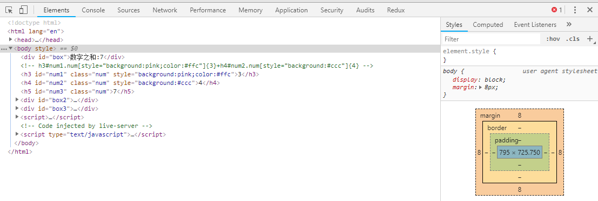

<<<<<<< HEAD
##基础
1.HTML(布局/展示)XX.html
  标签 `

 <input />`
  div (容器)
  input <==> type (操作型元素: 文本, 按钮, 单多选)
2.CSS(样式/美化)XX.css
  `标签中 style:???`
  `CSS文件中 元素:???`
3.JavaScript(动作/交互)XX.js
  `var a = 1, +,-,*,/,&&,||,:?, for|while, if|switch, console.log(), event, AJAX`
## Emmet
1. 自动标签
  a. '#' ==> id 
  b. '.' ==> class
  c. '[]' ==> attribute
  d. '{}' ==> content
  e. '$' ==> num
2. 创建临时JSON(延伸)

    `div{{'h':'$', 'num':'1$', 'id':'num1$', 'background':'#ff$'},}*6`
## String

1. 旧 ""   ++
2. 新 ``   ${}

        str1 += '<h' + ele.h + ' id=' + ele.id + ' style="background:' + (ele.bool ? ele.background : "#fff") + '">' + ele.num + '</h' + ele.h + '>'
        str2 += `<h${ele.h} id="${ele.id}"style="background:${ele.bool ? ele.background : "#fff"}">${ele.num}</h${ele.h}>`

## for

1.forEach 

  `arr.forEach((ele,index) => {})`

2.forin
  
  `for(index in obj/arr){}`

3.forof

  `for(ele of obj/arr){}`

## 变量转换

  `"" + all = String`
 
  `StringNum * 1 = Nunber`

  `NoNum(string, null, undefined) * Num = NaN(not a num)` 

## 浏览器

第一排:
1. 元素选择(界面 <==> 元素)
2. 手机适配(手机模式展示)
3. element下方的元素展示
4. console(控制台, 可以通过js直接操作元素)
5. Sources(文件目录, 直接查看源文件)
6. NetWork(请求)
7. Performance(执行测试)
https://segmentfault.com/a/1190000011516068
8. Memory(内存)
9. Application(缓存, cookie, SQL, Storage)
10. Security(网页安全)
11. Audits
  对当前网页进行网络利用情况、网页性能方面的诊断，并给出一些优化建议。比如列出所有没有用到的CSS文件等

第二排
1. styles样式(可以直接操作)
2. computed(样式计算)
3. Event listen监听的事件
4. Accessibility ??? 
=======
##基础
1.HTML(布局/展示)XX.html
  标签 `

 <input />`
  div (容器)
  input <==> type (操作型元素: 文本, 按钮, 单多选)
2.CSS(样式/美化)XX.css
  `标签中 style:???`
  `CSS文件中 元素:???`
3.JavaScript(动作/交互)XX.js
  `var a = 1, +,-,*,/,&&,||,:?, for|while, if|switch, console.log(), event, AJAX`
## Emmet
1. 自动标签
  a. '#' ==> id 
  b. '.' ==> class
  c. '[]' ==> attribute
  d. '{}' ==> content
  e. '$' ==> num
2. 创建临时JSON(延伸)

    `div{{'h':'$', 'num':'1$', 'id':'num1$', 'background':'#ff$'},}*6`
## String

1. 旧 ""   ++
2. 新 ``   ${}

        str1 += '<h' + ele.h + ' id=' + ele.id + ' style="background:' + (ele.bool ? ele.background : "#fff") + '">' + ele.num + '</h' + ele.h + '>'
        str2 += `<h${ele.h} id="${ele.id}"style="background:${ele.bool ? ele.background : "#fff"}">${ele.num}</h${ele.h}>`

## for

1.forEach 

  `arr.forEach((ele,index) => {})`

2.forin
  
  `for(index in obj/arr){}`

3.forof

  `for(ele of obj/arr){}`

## 变量转换

  `"" + all = String`
 
  `StringNum * 1 = Nunber`

  `NoNum(string, null, undefined) * Num = NaN(not a num)` 

## 浏览器

第一排:
1. 元素选择(界面 <==> 元素)
2. 手机适配(手机模式展示)
3. element下方的元素展示
4. console(控制台, 可以通过js直接操作元素)
5. Sources(文件目录, 直接查看源文件)
6. NetWork(请求)
7. Performance(执行测试)
https://segmentfault.com/a/1190000011516068
8. Memory(内存)
9. Application(缓存, cookie, SQL, Storage)
10. Security(网页安全)
11. Audits
  对当前网页进行网络利用情况、网页性能方面的诊断，并给出一些优化建议。比如列出所有没有用到的CSS文件等

第二排
1. styles样式(可以直接操作)
2. computed(样式计算)
3. Event listen监听的事件
4. Accessibility ??? 
>>>>>>> cffaa633d1407b7f720373df948027596ad4a1a5
5. Properties(原型)